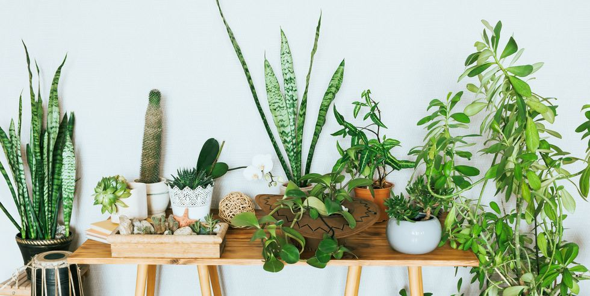

# PlantAI

/n
This is a simple application which use a convolutional neural network (CNN) to characterise the plants in my home.
## Web App
The link to the app deployed with streamlit and Heroku:
https://plantapp2020.herokuapp.com/

  

